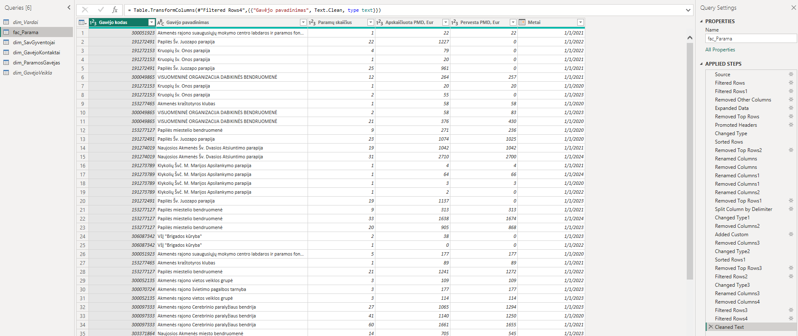
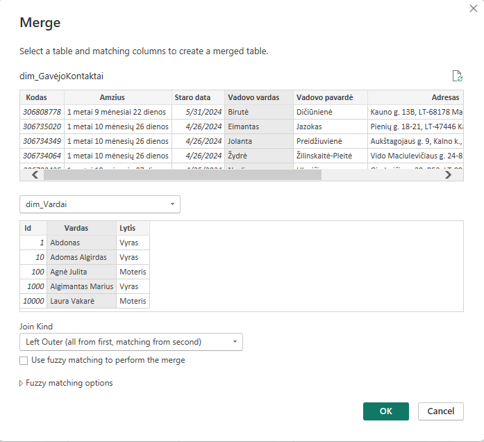

# Not All Barriers Are Visible: 1.2% Support in Lithuania


<span style="font-size: 11px; font-family: 'Segoe Print', 'Bradley Hand', 'Comic Sans MS', cursive; color: #555;">Landing page of Power BI report, visual created with Gamma.app</span>

## Project Overview

This project explores the question:

**Who wins in the race for 1.2% support, and who is left behind?**

In Lithuania, **1.2% support** is a part of a resident's already paid income tax that they can allocate to an eligible organisation. The receivers are usually support beneficiaries such as NGOs, public institutions, community organisations, religious communities, schools, Lithuanian organisations abroad, or eligible artists.

The analysis is based on publicly available data from **2020-2024** and focuses on how 1.2% support is distributed among recipients, how this distribution has changed over time, and which organisations receive the most support.

## Project Aim

The aim of this project was twofold:

1. **To explore the distribution of 1.2% support in Lithuania**

   This analysis investigates who receives 1.2% support, how the support is distributed among recipients, and how the situation changed between 2020 and 2024.

2. **To practice and strengthen the full data analysis workflow, with a particular focus on exploring and applying Power BI capabilities**

   This project allowed me to apply skills in data extraction, data cleaning, transformation, modelling, exploratory data analysis, visualization, and publishing a Power BI report.

## Research Questions

The project is guided by the following questions:

- Who are the main recipients of 1.2% support in Lithuania?
- How is 1.2% support distributed among recipients?
- How has the distribution changed between 2020 and 2024?
- Are the biggest recipients becoming stronger over time?
- Who may be left behind in the competition for support?

## Data Sources

The analysis uses public data from **2020-2024**.

Data was collected using:

- Web scraping
- Power BI API connection to public sources

## Tools Used

- Power BI Desktop
- Power BI Service
- Power Query
- DAX
- Python
- Power BI API connection
- Power BI App

## Data Analysis Workflow

### 1. Goal Setting and Research Questions

The project started with defining the aim of the analysis and formulating key questions to guide the exploration.

## 2. Data Extraction

Data was collected from publicly available sources using three different approaches: **Python web scraping, public APIs, and direct web data connections in Power Query**.

A key design principle of the extraction process was to **prioritise direct connections to original data sources wherever possible**. Rather than relying on manually downloaded and locally stored files, Power Query was connected directly to public APIs and web-hosted datasets.

This approach was chosen to make the data pipeline **repeatable, refreshable, and less dependent on manual intervention**. When data changes at a connected source, Power BI can retrieve the updated data during refresh and automatically reapply the existing Power Query transformation steps.

The overall extraction approach can be summarised as:

`Original source` → `Direct connection` → `Automated retrieval` → `Power Query transformations` → `Data model` → `Power BI report`

Where a direct structured source was not available, Python web scraping was used to collect and enrich additional organisation-level information.


### Python Web Scraping

A Python scraping script was developed to collect additional information about support recipients that was not available in the main dataset.

The script uses a structured workflow to identify organisations by company code, retrieve their public profile pages, extract selected attributes, validate the results, and write the enriched data back to CSV.

The main technical steps were:

1. **Loading and filtering input data** – the script reads an existing CSV file, selects only records that require additional lookup, normalises company codes, and removes duplicate targets before scraping.

2. **Building resilient HTTP requests** – a reusable `requests.Session` is configured with automatic retries for temporary HTTP errors such as `429`, `500`, `502`, `503`, and `504`. Randomised request headers and delays are also used between requests.

A retry strategy helps the scraping process handle temporary network or server failures without stopping the entire workflow:

```python
retry_strategy = Retry(
    total=3,
    backoff_factor=1,
    status_forcelist=[429, 500, 502, 503, 504],
    allowed_methods=frozenset(["GET", "HEAD", "OPTIONS"]),
)

adapter = HTTPAdapter(max_retries=retry_strategy)
session.mount("https://", adapter)
session.mount("http://", adapter)
```

3. **Searching for organisations by company code** – search URLs are dynamically constructed using query parameters. The returned search results are parsed to identify candidate organisation profile URLs.

4. **Validating organisation matches** – candidate profile pages are opened and the company code found on the page is compared with the original input code. This prevents data from being assigned to the wrong organisation.

Instead of automatically accepting the first search result, each candidate organisation is validated against the company code from the source dataset:

```python
for candidate_url in candidate_urls:
    random_delay(0.4, 1.0)

    company_response, company_soup = fetch_soup(candidate_url)

    if not company_response or not company_soup:
        continue

    found_code = gauti_imones_koda_is_soup(company_soup)

    if found_code == company_code:
        return company_response.url
```

5. **Parsing HTML content** – `BeautifulSoup` is used to navigate the HTML structure and locate the relevant information blocks and table fields.

6. **Extracting organisation attributes** – reusable extraction functions retrieve selected organisation information, including:

   - organisation name
   - company code
   - organisation age
   - registration/start date
   - manager
   - address
   - phone number
   - website

A reusable function locates a field by its HTML label and extracts the corresponding value:

```python
def gauti_reiksme_pagal_pavadinima(blokas, pavadinimas: str) -> str | None:
    label = blokas.find(
        "td",
        class_="name",
        string=lambda s: s and s.strip() == pavadinimas,
    )

    if not label:
        return None

    row = label.find_parent("tr")

    if not row:
        return None

    value_td = row.find("td", class_="value")

    return istraukti_td_value_teksta(value_td)
```

The same extraction logic can then be reused for multiple attributes:

```python
amzius = gauti_reiksme_pagal_pavadinima(blokas1, "Įmonės amžius")
vadovas = gauti_reiksme_pagal_pavadinima(blokas2, "Vadovas")
adresas = gauti_reiksme_pagal_pavadinima(blokas2, "Adresas")
```

7. **Cleaning extracted values** – regular expressions and helper functions are used to remove unnecessary whitespace and page-specific text before the values are stored.

8. **Handling missing or failed results** – if an organisation cannot be found or a request fails, the script creates a structured empty record instead of interrupting the entire process.

9. **Updating the original dataset** – scraped values are matched back to the corresponding records in the source CSV using the normalised company code.

10. **Exporting a timestamped result file** – the enriched dataset is written to a new UTF-8 CSV file, preserving the original data and creating a separate version for further analysis.

#### Technical Flow

`Input CSV` → `Filter target organisations` → `Normalise company codes` → `Build search URL` → `HTTP request with retry logic` → `Parse search results` → `Validate company code` → `Parse organisation page` → `Extract and clean attributes` → `Update original records` → `Export enriched CSV`

The purpose of the scraping process was not only to collect additional information, but also to **automate a repetitive data enrichment workflow, introduce validation and error-handling logic, and transform semi-structured web content into structured data suitable for Power BI analysis**.


### Public API and Web Data Connections with Power Query

In addition to Python web scraping, Power Query was used to retrieve data from **public APIs and web-hosted data sources**.

Wherever technically possible, direct connections to the original sources were preferred over manually downloaded local files. The objective was to create a **refreshable data extraction workflow** in which Power BI can retrieve updated source data and reapply the defined transformation steps during refresh.

The project integrates data from `data.gov.lt` open-data API endpoints, VMI Excel workbooks, JSON and CSV responses, and the enriched organisation data produced during the scraping process.

Different retrieval methods were used depending on how each source exposed its data:

- **Public API endpoints** – `data.gov.lt` was queried using URL parameters to filter records, select required fields, define date ranges, sort results, and specify output formats.
- **JSON API responses** – JSON data was retrieved with `Web.Contents()` and parsed using `Json.Document()`.
- **CSV API responses** – API results returned as CSV were retrieved with `Web.Contents()` and parsed using `Csv.Document()`.
- **Web-hosted Excel files** – VMI Excel workbooks were retrieved directly using `Web.Contents()` and processed with `Excel.Workbook()`.
- **Web-hosted CSV files** – additional prepared datasets were connected directly to Power Query and incorporated into the transformation workflow.

This approach separates the **source data from the transformation logic**: external sources provide the data, while Power Query stores the repeatable steps required to clean, reshape, and prepare it for analysis.

The main technical steps were:

1. **Connecting directly to external sources** – Power Query's `Web.Contents()` was used to retrieve data from public API endpoints and web-hosted files.

2. **Handling multiple data formats** – different Power Query functions were used depending on the source:
   - `Json.Document()` for JSON
   - `Csv.Document()` for CSV
   - `Excel.Workbook()` for Excel

3. **Filtering API data at source level** – where supported, query parameters were used to request only the records and fields required for the analysis rather than retrieving the complete dataset.

4. **Selecting relevant Excel worksheets dynamically** – the VMI workbook contains multiple worksheets. Power Query identifies the required sheets using their naming pattern instead of relying on one manually selected worksheet.

5. **Expanding and transforming nested worksheet data** – selected Excel worksheets are expanded into a tabular structure and unnecessary workbook elements are removed.

6. **Standardising heterogeneous sources** – data from different providers and formats is cleaned and transformed into consistent analytical tables with appropriate identifiers, column structures, and data types.

7. **Preparing fact and dimension tables** – transformed data is organised into tables with different analytical purposes, including the central support fact table and supporting recipient, municipality/population, and name dimensions.

8. **Integrating the sources into the Power BI data model** – common identifiers are used to establish relationships between independently collected datasets.

9. **Designing for refresh and automation** – direct source connections were prioritised so that updated data can be retrieved during Power BI refresh and the same transformation pipeline can be reapplied automatically, reducing repeated manual downloading and preparation.


#### API Querying and Source-Level Filtering

One of the main technical solutions was to perform filtering directly through the public API rather than retrieving the complete dataset and filtering it only after import.

For example, the population data request defines the required municipality type, age group, sex, reporting period, selected fields, sorting, and output format:

```powerquery
Source =
    Csv.Document(
        Web.Contents(
            "https://get.data.gov.lt/.../:format/csv?
            administracine_teritorija.contains=""sav.""&
            amzius=""Iš viso pagal amžių""&
            lytis=""Vyrai ir moterys""&
            laikotarpis._ge=""2021-01-01""&
            laikotarpis._le=""2025-01-01""&
            _select=administracine_teritorija,laikotarpis,verte&
            _sort=laikotarpis,administracine_teritorija"
        ),
        [
            Delimiter=",",
            Columns=3,
            Encoding=65001,
            QuoteStyle=QuoteStyle.None
        ]
    )
```

This allows the API to return only the analytical subset required for the model:

`API endpoint` → `Apply filters` → `Select fields` → `Sort results` → `Return CSV` → `Power Query`

Another API connection retrieves selected name-related attributes as JSON:

```powerquery
Source =
    Json.Document(
        Web.Contents(
            "https://get.data.gov.lt/datasets/gov/vlkk/vardai/Vardas?_select=id,pilnas_vardas,lytis"
        )
    )
```

Using both CSV and JSON API responses allowed data from different exchange formats to be converted into structured Power Query tables.


#### Dynamic VMI Excel Processing

The main VMI support dataset is provided as a publicly available Excel workbook containing multiple worksheets.

Power Query retrieves the workbook directly from the web:

```powerquery
Source =
    Excel.Workbook(
        Web.Contents("https://www.vmi.lt/...xlsx"),
        null,
        true
    )
```

Rather than selecting a single worksheet manually, Power Query identifies the relevant worksheets according to their naming pattern:

```powerquery
#"Filtered Rows" =
    Table.SelectRows(
        Source,
        each Text.StartsWith([Item], "Apskaičiuota už ")
    ),

#"Filtered Rows1" =
    Table.SelectRows(
        #"Filtered Rows",
        each [Kind] = "Sheet"
    )
```

This makes it possible to process multiple relevant worksheets without hard-coding one exact sheet name.

The selected worksheet tables are then expanded for further transformation:

```powerquery
#"Removed Other Columns" =
    Table.SelectColumns(
        #"Filtered Rows1",
        {"Name", "Data"}
    ),

#"Expanded Data" =
    Table.ExpandTableColumn(
        #"Removed Other Columns",
        "Data",
        {
            "Column1", "Column2", "Column3", "Column4",
            "Column5", "Column6", "Column7", "Column8",
            "Column9", "Column10", "Column11"
        }
    )
```

The same VMI source is subsequently transformed for different analytical purposes, including the central `fac_Parama` fact table and the `Dim_ParamosGavejas` recipient dimension.


#### Refreshable Data Pipeline

A central objective of the extraction design was to **minimise manual data handling and make the workflow reusable when source data changes**.

With direct API and web connections, Power BI can request the source data again during refresh. The existing Power Query steps can then automatically repeat the cleaning, filtering, reshaping, and preparation process before the updated data is loaded into the model.

The intended workflow is:

`Source data changes` → `Power BI refresh` → `Updated data retrieved` → `Power Query transformations reapplied` → `Data model updated` → `Report updated`

This means that the transformation process does not need to be manually repeated every time the underlying connected data changes.

#### Technical Flow

`Original public sources` → `API / direct web connection` → `Source-level filtering` → `JSON / CSV / Excel ingestion` → `Power Query transformations` → `Data standardisation` → `Fact and dimension tables` → `Power BI data model` → `Refresh with updated source data`

The main technical challenge was not simply retrieving external data, but **combining different data acquisition methods and heterogeneous source formats into a consistent and refreshable analytical model**.

The resulting workflow combines **API-based data retrieval, source-level filtering, direct web-file ingestion, multi-format processing, dynamic Excel worksheet selection, Python-based data enrichment, and repeatable Power Query transformations**.

Where supported by the source, this approach reduces repetitive manual work and allows changes in the original data to flow through the same extraction, transformation, modelling, and reporting process during refresh.

> **Note:** Refreshability depends on the original provider maintaining the connected URL, API endpoint, and expected data structure. If a source changes its location or schema, the corresponding query may require adjustment.

## 3. Data Cleaning and Transformation

The extracted data came from several sources and formats, including **JSON API responses, CSV files, Excel workbooks, and Python-enriched data**. These sources differed considerably in structure and were not immediately suitable for analysis.

Data cleaning and transformation were performed primarily in **Power Query using M**.

A key objective was to keep the transformation logic inside Power Query rather than manually modifying the source files. This makes the cleaning process **repeatable and refreshable**: when connected source data is refreshed, the same transformation steps can be applied again automatically.

### Power Query Transformation Workflow

The cleaning process included:

- expanding nested JSON structures
- restructuring multi-sheet Excel data
- removing source metadata and unnecessary rows
- promoting and standardising headers
- assigning appropriate data types
- cleaning and standardising text values
- handling null and inconsistent values
- removing duplicate records
- extracting structured information from text
- creating calculated and derived columns
- merging datasets using common identifiers
- grouping and aggregating records
- preparing fact and dimension tables for the Power BI model

The transformations were built as sequential **Applied Steps**, allowing each stage of the cleaning process to remain visible, reproducible, and easier to troubleshoot.



*Example of the Power Query transformation pipeline showing the sequence of cleaning and reshaping operations applied to the source data.*


### Reshaping Nested API Data

Some API responses were not returned as simple flat tables.

For example, the public names dataset contained nested JSON structures. Power Query was used to expand the JSON list and its records into rows and columns suitable for the analytical model.

```powerquery
#"Expanded _data" =
    Table.ExpandListColumn(
        #"Converted to Table",
        "_data"
    ),

#"Expanded _data1" =
    Table.ExpandRecordColumn(
        #"Expanded _data",
        "_data",
        {"id", "pilnas_vardas", "lytis"},
        {"_data.id", "_data.pilnas_vardas", "_data.lytis"}
    )
```

The resulting fields were then assigned appropriate data types and renamed into a consistent analytical structure.

This provided practical experience working with **nested API responses and converting semi-structured JSON into relational tables**.


### Restructuring the VMI Excel Data

The main VMI dataset required more extensive transformation because the source workbook was designed primarily for human reading rather than analytical processing.

The workbook contained:

- multiple annual worksheets
- descriptive rows above the actual data
- unnecessary columns
- year information embedded in text
- headers requiring standardisation

Instead of cleaning each year's worksheet manually, Power Query identifies relevant worksheets by their naming pattern and processes them through the same transformation pipeline.

One useful transformation involved extracting the reporting year from text such as:

`Apskaičiuota už 2024 metus`

The text was split and the year was converted into a proper date value:

```powerquery
#"Split Column by Delimiter" =
    Table.SplitColumn(
        #"Removed Top Rows1",
        "Metai",
        Splitter.SplitTextByDelimiter(" ", QuoteStyle.Csv),
        {"Metai.1", "Metai.2", "Metai.3", "Metai.4"}
    ),

#"Added Custom" =
    Table.AddColumn(
        #"Changed Type1",
        "Metai",
        each #date(Number.From([Metai.3]), 1, 1)
    )
```

Converting the reporting year into a real date rather than keeping it as text made the field suitable for **relationships with the calendar table, filtering, and time-based analysis**.

This workflow allowed data from multiple reporting years to be transformed into a consistent structure without manually preparing separate files for each year.


### Data Enrichment with Merge Queries

Power Query was also used to combine independently collected datasets.

One example involved the organisation data collected through Python web scraping. The manager field was cleaned and separated into first name and surname.

The manager's first name was then matched with the public names reference dataset using a **Left Outer Join**.



*Organisation data enriched by merging the manager's first name with the public names reference table.*

The merge was performed using `Table.NestedJoin()`:

```powerquery
#"Merged Queries" =
    Table.NestedJoin(
        #"Renamed Columns1",
        {"Vadovo vardas"},
        dim_Vardai,
        {"Vardas"},
        "dim_Vardai",
        JoinKind.LeftOuter
    ),

#"Expanded dim_Vardai" =
    Table.ExpandTableColumn(
        #"Merged Queries",
        "dim_Vardai",
        {"Lytis"},
        {"Vadovo lytis"}
    )
```

Where no corresponding value could be found in the reference table, the result was explicitly classified as `Nežinoma` (Unknown) rather than leaving an unexplained null value.

This demonstrated how Power Query can be used not only for cleaning individual datasets, but also for **lookup-based enrichment and integration of independently collected data sources**.

> **Data limitation:** the resulting gender category is inferred from the first-name classification available in the external reference dataset. It should therefore be interpreted as a name-based classification rather than a verified personal attribute.


### Handling Missing, Duplicate, and Invalid Records

Data quality checks were applied before loading tables into the model.

These included:

- filtering records without required organisation identifiers
- removing records with missing recipient names
- replacing selected missing categorical values with explicit `Unknown` categories
- removing duplicate records using `Table.Distinct()`
- cleaning non-printable characters using `Text.Clean()`
- trimming unnecessary whitespace using `Text.Trim()`
- assigning explicit data types after transformations

These steps helped ensure that identifiers used in relationships were valid and that categorical values behaved consistently in calculations and visualisations.


### Aggregating Municipality Population Data

The municipality dataset contained population observations for several reporting periods.

Power Query's grouping functionality was used to calculate the average population for each municipality across the selected period:

```powerquery
#"Grouped Rows" =
    Table.Group(
        #"Sorted Rows",
        {"Savivaldybė"},
        {
            {
                "Gyventojų skaičius laikotarpiui",
                each List.Average([Gyventojų skaičius]),
                type nullable number
            }
        }
    )
```

The resulting values were rounded and used as municipality-level contextual information in the analytical model.

> **Modelling decision:** population was aggregated to an average for the selected period because it was used as a municipality-level contextual attribute rather than as a year-specific measure.


### Power Query Features Applied

Through the transformation process, the project applied several important Power Query and M concepts, including:

| Power Query feature | Application in the project |
|---|---|
| `Table.SelectRows()` | Filtering invalid and irrelevant records |
| `Table.SelectColumns()` / `Table.RemoveColumns()` | Controlling the analytical schema |
| `Table.PromoteHeaders()` | Converting source rows into column headers |
| `Table.TransformColumnTypes()` | Explicit management of text, dates, identifiers, and numeric values |
| `Table.ExpandListColumn()` | Expanding nested JSON lists |
| `Table.ExpandRecordColumn()` | Converting JSON records into columns |
| `Table.ExpandTableColumn()` | Expanding nested Excel worksheet tables |
| `Table.SplitColumn()` | Extracting structured information from text |
| `Table.AddColumn()` | Creating derived analytical fields |
| `Table.NestedJoin()` | Combining related datasets |
| `Table.Distinct()` | Removing duplicate records |
| `Table.Group()` | Aggregating municipality data |
| `Table.ReplaceValue()` | Handling missing categorical values |
| `Text.Clean()` / `Text.Trim()` | Standardising text values |
| `#date()` | Creating proper date values from extracted year information |


### From Raw Data to Model-Ready Tables

The overall transformation process followed this structure:

`Raw API / CSV / Excel data`  
↓  
`Expand and restructure source data`  
↓  
`Remove metadata and unnecessary fields`  
↓  
`Clean and standardise values`  
↓  
`Validate identifiers and handle missing data`  
↓  
`Create derived fields`  
↓  
`Merge reference datasets`  
↓  
`Remove duplicates and aggregate where required`  
↓  
`Prepare fact and dimension tables`  
↓  
`Load into Power BI data model`

A key lesson from this project was using Power Query as more than a basic data-cleaning interface. It became the project's **repeatable ETL layer**, responsible for transforming heterogeneous source data into consistent, model-ready tables.

Because the transformations are stored as Power Query steps rather than performed manually on the original files, the same cleaning logic can be reapplied during refresh:

`Updated source data` → `Power Query refresh` → `Transformation steps reapplied` → `Model-ready tables` → `Updated Power BI model`

### 4. Data Modelling

The data was structured using a star-schema-based model, with fac_Parama as the central fact table containing support amounts, number of supporters, recipient identifiers, and year.
Supporting dimension tables provide additional context about:

- Support recipients and their characteristics
- Recipient contact and organisational information
- Municipality and population data
- Calendar
  
The model uses one-to-many relationships between dimension tables and the central fact table, allowing support data to be analysed across different years, recipients, organisation characteristics, and geographical areas.
A dedicated calendar table was created to support consistent time-based filtering and yearly comparisons.

Municipality population data was also integrated into the model, allowing support patterns to be explored in relation to the size and characteristics of different municipalities.
Separate measure tables were used to organise DAX calculations and keep the model easier to navigate and maintain. These include general KPIs as well as specialised calculations for the Top 10 recipients and supporter behaviour.

This structure supports interactive filtering and makes it possible to analyse the same support measures from multiple perspectives without duplicating the underlying data.


### 5. DAX Calculations

DAX formulas were used to enrich the dataset and create additional insights.

This included:

- Calculated columns
- Measures
- Ranking calculations
- Yearly comparisons
- Totals and percentage calculations

### 6. Exploratory Data Analysis

Exploratory data analysis was carried out to understand the structure, patterns, and changes in the data.

The analysis focused on:

- Distribution of support among recipients
- Top recipients by amount received
- Top recipients by number of supporters
- Changes over time
- Differences between large and smaller recipients

### 7. Report Design and Interactivity

Power BI visualizations were selected and adapted to make the report flexible and easy to explore.

The report includes:

- Relevant charts and visuals
- Slicers
- Tooltips
- Drill-through pages
- Interactive filtering
- Yearly comparison views

### 8. Publishing

The final report was published in Power BI Service and shared as a Power BI App.

## Key Findings

One of the main findings is that the **top 10 largest recipients** have grown over the five-year period, both in terms of:

- the amount of support received
- the number of people allocating support to them

This suggests that visibility, recognition, and existing reach may play an important role in the competition for 1.2% support.

Additional findings will be listed here:

- Finding 1
- Finding 2
- Finding 3
- Finding 4

## Project Status

This project is currently in progress.

The next steps include:

- Adding more findings
- Refining visualizations
- Improving report interactivity
- Publishing final screenshots or report links
- Updating this README with final conclusions

## How to View the Report

Power BI report link:

[Add your Power BI report or app link here]

## Author

Created by **Ramune Idzelyte**

Have a project where data, people, or impact matter? I would be happy to connect on LinkedIn.
