# Not All Barriers Are Visible: 1.2% Support in Lithuania

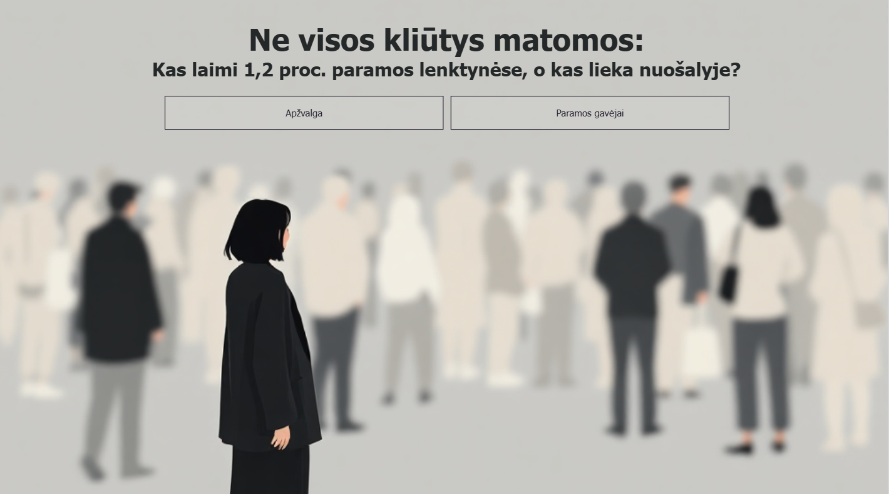

*Landing page of the Power BI report introducing the central research question. Visual created with Gamma.app.*

## Project Overview

This project explores the question:

**Who wins in the race for 1.2% support, and who is left behind?**

In Lithuania, **1.2% support** is a share of a resident's already paid personal income tax that can be allocated to an eligible recipient. These recipients include NGOs, public institutions, community organisations, religious communities, schools, Lithuanian organisations abroad, and eligible artists.

The analysis uses publicly available data from **2020–2024** and explores how 1.2% support is distributed among recipients, how this distribution has changed over time, and which organisations receive the largest share of support.

## Project Aim

The project had two main objectives:

1. **Explore the distribution of 1.2% support in Lithuania**

   Analyse who receives support, how it is distributed among recipients, and how the distribution changed between 2020 and 2024.

2. **Practise and strengthen the full data analysis workflow, with a particular focus on Power BI**

   Apply skills in data extraction, data cleaning, transformation, modelling, exploratory analysis, DAX, visualisation, report design, and Power BI publishing.

## Data Sources

The analysis uses public data from **2020–2024**.

Data was collected through:

- Python web scraping
- Public APIs
- Direct web data connections in Power Query

## Tools Used

- Power BI Desktop
- Power BI Service
- Power BI App
- Power Query
- DAX
- Python
- Public APIs

## Data Analysis Workflow

### 1. Goal Setting and Research Questions

The project started by defining the analytical goal and formulating questions to guide the exploration:

- Who are the main recipients of 1.2% support in Lithuania?
- How is support distributed among recipients?
- How has the distribution changed between 2020 and 2024?
- Are the largest recipients becoming stronger over time?
- Who may be left behind in the competition for support?

#### Data 

| Dataset | Source | Raw Format / Structure | Main Data | Transformation & Cleaning Relevance | Used For |
|---|---|---|---|---|---|
| **1.2% Support Statistics** | [Lithuanian State Tax Inspectorate (VMI)](https://www.vmi.lt/) | Excel workbook · multiple sheets · semi-structured | Recipient code and name, municipality, legal form, number of allocations, calculated and transferred support amounts, year | Multiple yearly sheets combined; metadata/header rows removed; headers promoted; irrelevant columns removed; year extracted from text; numeric and date types assigned; null recipient records filtered; organisation names cleaned | Main fact table for analysing the distribution of 1.2% support |
| **Municipality Population** | [Official Statistics Portal / Data.gov.lt](https://get.data.gov.lt/) | CSV API · structured tabular data | Municipality, year, population | API filtered to municipalities, total age population and both sexes; duplicates removed; null values filtered; data types assigned; municipality records grouped and average population for 2021–2025 calculated and rounded | Population-based comparison of support between municipalities |
| **Lithuanian First Names** | [State Commission of the Lithuanian Language (VLKK) via Data.gov.lt](https://get.data.gov.lt/datasets/gov/vlkk/vardai/Vardas) | JSON API · nested records | First name and gender | Nested JSON expanded into a tabular structure; fields renamed; data types assigned; later joined to organisation representative first names | Estimating the gender of organisation representatives |
| **Organisation Details** | [rekvizitai.csv](https://github.com/Ramuneid/1.2-Support-in-Lithuania/blob/main/Data%20/rekvizitai.csv) | CSV · scraped/enriched dataset | Organisation code, registration date, representative, address, phone, website | Unnecessary scraping/helper fields removed; missing codes filtered; representative name cleaned and split into first name and surname; duplicates removed; names joined with the VLKK names table; unmatched gender values classified as `Nežinoma` | Enriching recipient records with organisation and representative information |
| **Recipient / Organisation Dimension** | [VMI 1.2% Support Statistics](https://www.vmi.lt/) | Derived from Excel source | Recipient code, recipient name, municipality, legal form | Created from the VMI support dataset; support measures and year fields removed; duplicate organisations removed; one record retained per recipient | Dimension table for the Power BI data model |

### 2. Data Extraction

Data was collected from publicly available sources using three approaches: **Python web scraping, public APIs, and direct web data connections in Power Query**.

A key design principle was to **prioritise direct connections to original data sources wherever possible**. Instead of relying on manually downloaded and locally stored files, Power Query was connected directly to public APIs and web-hosted datasets.

This was intended to make the pipeline **repeatable, refreshable, and less dependent on manual intervention**. When a connected source changes, Power BI can retrieve the updated data during refresh and reapply the existing transformation steps.

The overall extraction workflow is:

`Original source` → `Direct connection` → `Automated retrieval` → `Power Query transformations` → `Data model` → `Power BI report`

Where a suitable structured source was not available, Python web scraping was used to collect and enrich additional organisation-level information.

#### Python Web Scraping

A Python scraping script was developed to collect recipient information that was not available in the main support dataset.

The script identifies organisations by company code, retrieves their public profile pages, extracts selected attributes, validates the results, and writes the enriched data back to CSV.

The main technical steps were:

1. **Load and filter input data**  
   Read the existing CSV, select records requiring additional lookup, normalise company codes, and remove duplicate targets.

2. **Build resilient HTTP requests**  
   Configure a reusable `requests.Session` with retries for temporary HTTP errors such as `429`, `500`, `502`, `503`, and `504`. Randomised request headers and delays are also used between requests.

A retry strategy helps the process recover from temporary network or server failures without stopping the entire workflow:

```python
retry_strategy = Retry(
    total=3,
    backoff_factor=1,
    status_forcelist=[429, 500, 502, 503, 504],
    allowed_methods=frozenset(["GET", "HEAD", "OPTIONS"]),
)

adapter = HTTPAdapter(max_retries=retry_strategy)
session.mount("https://", adapter)
session.mount("http://", adapter)
```

3. **Search for organisations by company code**  
   Construct search URLs dynamically using query parameters and parse the returned results to identify candidate organisation profiles.

4. **Validate organisation matches**  
   Open candidate profile pages and compare the company code found on the page with the source record before accepting the result.

```python
for candidate_url in candidate_urls:
    random_delay(0.4, 1.0)

    company_response, company_soup = fetch_soup(candidate_url)

    if not company_response or not company_soup:
        continue

    found_code = gauti_imones_koda_is_soup(company_soup)

    if found_code == company_code:
        return company_response.url
```

5. **Parse HTML content**  
   Use `BeautifulSoup` to navigate the HTML structure and locate the relevant information blocks and table fields.

6. **Extract organisation attributes**  
   Reusable functions retrieve selected fields including:

   - Organisation name
   - Company code
   - Organisation age
   - Registration/start date
   - Manager
   - Address
   - Phone number
   - Website

A reusable function locates a field by its HTML label and extracts the corresponding value:

```python
def gauti_reiksme_pagal_pavadinima(blokas, pavadinimas: str) -> str | None:
    label = blokas.find(
        "td",
        class_="name",
        string=lambda s: s and s.strip() == pavadinimas,
    )

    if not label:
        return None

    row = label.find_parent("tr")

    if not row:
        return None

    value_td = row.find("td", class_="value")

    return istraukti_td_value_teksta(value_td)
```

The same function can then be reused for multiple attributes:

```python
amzius = gauti_reiksme_pagal_pavadinima(blokas1, "Įmonės amžius")
vadovas = gauti_reiksme_pagal_pavadinima(blokas2, "Vadovas")
adresas = gauti_reiksme_pagal_pavadinima(blokas2, "Adresas")
```

7. **Clean extracted values**  
   Use regular expressions and helper functions to remove unnecessary whitespace and page-specific text.

8. **Handle missing or failed results**  
   Create structured empty records where an organisation cannot be found or a request fails, rather than interrupting the entire process.

9. **Update the original dataset**  
   Match scraped values back to source records using the normalised company code.

10. **Export a timestamped result file**  
    Write the enriched dataset to a new UTF-8 CSV file, preserving the original source data.

##### Technical Flow

`Input CSV` → `Filter target organisations` → `Normalise company codes` → `Build search URL` → `HTTP request with retry logic` → `Parse search results` → `Validate company code` → `Parse organisation page` → `Extract and clean attributes` → `Update original records` → `Export enriched CSV`

The scraping workflow was designed not only to collect additional information, but also to **automate repetitive enrichment, introduce validation and error handling, and convert semi-structured web content into structured data suitable for Power BI analysis**.

#### Public API and Web Data Connections with Power Query

Power Query was also used to retrieve data from **public APIs and web-hosted data sources**.

Where technically possible, direct connections to original sources were preferred over manually downloaded local files. The objective was to create a **refreshable extraction workflow** in which Power BI can retrieve updated data and reapply the defined transformation steps.

The project integrates data from `data.gov.lt` API endpoints, VMI Excel workbooks, JSON and CSV responses, and organisation data enriched through Python.

Different retrieval methods were used depending on the source format:

- **Public API endpoints** – URL parameters were used to filter records, select fields, define date ranges, sort results, and specify output formats.
- **JSON API responses** – retrieved using `Web.Contents()` and parsed with `Json.Document()`.
- **CSV API responses** – retrieved using `Web.Contents()` and parsed with `Csv.Document()`.
- **Web-hosted Excel files** – retrieved using `Web.Contents()` and processed with `Excel.Workbook()`.
- **Web-hosted CSV files** – connected directly to Power Query and incorporated into the transformation workflow.

This approach separates the **source data from the transformation logic**: external providers supply the data, while Power Query stores the repeatable steps required to clean, reshape, and prepare it for analysis.

The main technical steps were:

1. **Connect directly to external sources**
2. **Handle multiple data formats**
3. **Filter API data at source level**
4. **Select relevant Excel worksheets dynamically**
5. **Expand and transform nested worksheet data**
6. **Standardise heterogeneous sources**
7. **Prepare fact and dimension tables**
8. **Integrate sources into the Power BI data model**
9. **Design for refresh and repeatability**

##### API Querying and Source-Level Filtering

Where supported, filtering was performed directly through the public API rather than after importing the complete dataset.

For example, the population-data request specifies the municipality type, age group, sex, reporting period, selected fields, sorting, and output format:

```powerquery
Source =
    Csv.Document(
        Web.Contents(
            "https://get.data.gov.lt/.../:format/csv?
            administracine_teritorija.contains=""sav.""&
            amzius=""Iš viso pagal amžių""&
            lytis=""Vyrai ir moterys""&
            laikotarpis._ge=""2021-01-01""&
            laikotarpis._le=""2025-01-01""&
            _select=administracine_teritorija,laikotarpis,verte&
            _sort=laikotarpis,administracine_teritorija"
        ),
        [
            Delimiter=",",
            Columns=3,
            Encoding=65001,
            QuoteStyle=QuoteStyle.None
        ]
    )
```

This allows the API to return only the analytical subset required for the model:

`API endpoint` → `Apply filters` → `Select fields` → `Sort results` → `Return CSV` → `Power Query`

Another API connection retrieves selected name-related attributes as JSON:

```powerquery
Source =
    Json.Document(
        Web.Contents(
            "https://get.data.gov.lt/datasets/gov/vlkk/vardai/Vardas?_select=id,pilnas_vardas,lytis"
        )
    )
```

Using both CSV and JSON responses allowed data from different exchange formats to be converted into structured Power Query tables.

##### Dynamic VMI Excel Processing

The main VMI support dataset is provided as a publicly available Excel workbook containing multiple worksheets.

Power Query retrieves the workbook directly from the web:

```powerquery
Source =
    Excel.Workbook(
        Web.Contents("https://www.vmi.lt/...xlsx"),
        null,
        true
    )
```

Rather than selecting one worksheet manually, Power Query identifies the relevant sheets according to their naming pattern:

```powerquery
#"Filtered Rows" =
    Table.SelectRows(
        Source,
        each Text.StartsWith([Item], "Apskaičiuota už ")
    ),

#"Filtered Rows1" =
    Table.SelectRows(
        #"Filtered Rows",
        each [Kind] = "Sheet"
    )
```

The selected worksheet tables are then expanded for further transformation:

```powerquery
#"Removed Other Columns" =
    Table.SelectColumns(
        #"Filtered Rows1",
        {"Name", "Data"}
    ),

#"Expanded Data" =
    Table.ExpandTableColumn(
        #"Removed Other Columns",
        "Data",
        {
            "Column1", "Column2", "Column3", "Column4",
            "Column5", "Column6", "Column7", "Column8",
            "Column9", "Column10", "Column11"
        }
    )
```

The same VMI source is later transformed for different analytical purposes, including the central `fac_Parama` fact table and the recipient dimension.

##### Refreshable Data Pipeline

A central objective of the extraction design was to **reduce manual data handling and make the workflow reusable when source data changes**.

With direct API and web connections, Power BI can request the source data again during refresh and reapply the existing Power Query transformation steps.

The intended workflow is:

`Source data changes` → `Power BI refresh` → `Updated data retrieved` → `Power Query transformations reapplied` → `Data model updated` → `Report updated`

This means the transformation process does not need to be manually repeated whenever the underlying connected data changes.

##### Technical Flow

`Original public sources` → `API / direct web connection` → `Source-level filtering` → `JSON / CSV / Excel ingestion` → `Power Query transformations` → `Data standardisation` → `Fact and dimension tables` → `Power BI data model` → `Refresh with updated source data`

The main technical challenge was not simply retrieving external data, but **combining different acquisition methods and heterogeneous source formats into a consistent and refreshable analytical model**.

The resulting workflow combines **API-based retrieval, source-level filtering, direct web-file ingestion, multi-format processing, dynamic worksheet selection, Python-based enrichment, and repeatable Power Query transformations**.

> **Note:** Refreshability depends on the original provider maintaining the connected URL, API endpoint, and expected data structure. If the source location or schema changes, the corresponding query may require adjustment.

### 3. Data Cleaning and Transformation

The extracted data came from several sources and formats, including **JSON API responses, CSV files, Excel workbooks, and Python-enriched data**. These sources differed considerably in structure and were not immediately suitable for analysis.

Cleaning and transformation were performed primarily in **Power Query using M**.

A key objective was to keep transformation logic inside Power Query rather than manually modifying the source files. This makes the process **repeatable and refreshable**: when connected source data is refreshed, the same transformation steps can be applied again automatically.

#### Power Query Transformation Workflow

The cleaning process included:

- Expanding nested JSON structures
- Restructuring multi-sheet Excel data
- Removing source metadata and unnecessary rows
- Promoting and standardising headers
- Assigning appropriate data types
- Cleaning and standardising text values
- Handling null and inconsistent values
- Removing duplicate records
- Extracting structured information from text
- Creating calculated and derived columns
- Merging datasets using common identifiers
- Grouping and aggregating records
- Preparing fact and dimension tables for the Power BI model

The transformations were built as sequential **Applied Steps**, keeping each stage visible, reproducible, and easier to troubleshoot.


*Power Query transformation pipeline showing the sequence of cleaning and reshaping operations applied to the source data.*

#### Reshaping Nested API Data

Some API responses were not returned as simple flat tables.

For example, the public names dataset contained nested JSON structures. Power Query was used to expand the JSON list and records into rows and columns suitable for the analytical model:

```powerquery
#"Expanded _data" =
    Table.ExpandListColumn(
        #"Converted to Table",
        "_data"
    ),

#"Expanded _data1" =
    Table.ExpandRecordColumn(
        #"Expanded _data",
        "_data",
        {"id", "pilnas_vardas", "lytis"},
        {"_data.id", "_data.pilnas_vardas", "_data.lytis"}
    )
```

The resulting fields were then assigned appropriate data types and renamed into a consistent analytical structure.

This provided practical experience working with **nested API responses and converting semi-structured JSON into relational tables**.

#### Restructuring the VMI Excel Data

The main VMI dataset required more extensive transformation because the source workbook was designed primarily for human reading rather than analytical processing.

The workbook contained:

- Multiple annual worksheets
- Descriptive rows above the actual data
- Unnecessary columns
- Year information embedded in text
- Headers requiring standardisation

Instead of cleaning each annual worksheet manually, Power Query identifies relevant sheets by naming pattern and processes them through the same transformation pipeline.

One useful transformation involved extracting the reporting year from text such as:

`Apskaičiuota už 2024 metus`

The text was split and converted into a proper date value:

```powerquery
#"Split Column by Delimiter" =
    Table.SplitColumn(
        #"Removed Top Rows1",
        "Metai",
        Splitter.SplitTextByDelimiter(" ", QuoteStyle.Csv),
        {"Metai.1", "Metai.2", "Metai.3", "Metai.4"}
    ),

#"Added Custom" =
    Table.AddColumn(
        #"Changed Type1",
        "Metai",
        each #date(Number.From([Metai.3]), 1, 1)
    )
```

Converting the reporting year into a date rather than keeping it as text made the field suitable for **calendar relationships, filtering, and time-based analysis**.

This workflow allowed multiple reporting years to be transformed into a consistent structure without manually preparing separate files.

#### Data Enrichment with Merge Queries

Power Query was also used to combine independently collected datasets.

One example involved organisation information collected through Python web scraping. The manager field was cleaned and separated into first name and surname.

The manager's first name was then matched with the public names reference dataset using a **Left Outer Join**.


*Organisation data enriched by merging the manager's first name with the public names reference table.*

The merge was performed using `Table.NestedJoin()`:

```powerquery
#"Merged Queries" =
    Table.NestedJoin(
        #"Renamed Columns1",
        {"Vadovo vardas"},
        dim_Vardai,
        {"Vardas"},
        "dim_Vardai",
        JoinKind.LeftOuter
    ),

#"Expanded dim_Vardai" =
    Table.ExpandTableColumn(
        #"Merged Queries",
        "dim_Vardai",
        {"Lytis"},
        {"Vadovo lytis"}
    )
```

Where no corresponding value could be found in the reference table, the result was classified as `Nežinoma` (Unknown) rather than left as an unexplained null.

This demonstrates how Power Query can support both **data cleaning and lookup-based enrichment across independently collected datasets**.

> **Data limitation:** The resulting gender category is inferred from the first-name classification available in the external reference dataset. It should therefore be interpreted as a name-based classification rather than a verified personal attribute.

#### Handling Missing, Duplicate, and Invalid Records

Data quality checks were applied before loading tables into the model.

These included:

- Filtering records without required organisation identifiers
- Removing records with missing recipient names
- Replacing selected missing categorical values with explicit `Unknown` categories
- Removing duplicate records using `Table.Distinct()`
- Cleaning non-printable characters using `Text.Clean()`
- Trimming unnecessary whitespace using `Text.Trim()`
- Assigning explicit data types after transformations

These steps helped ensure that identifiers used in relationships were valid and that categorical values behaved consistently in calculations and visualisations.

#### Aggregating Municipality Population Data

The municipality dataset contained population observations for several reporting periods.

Power Query grouping was used to calculate the average population for each municipality across the selected period:

```powerquery
#"Grouped Rows" =
    Table.Group(
        #"Sorted Rows",
        {"Savivaldybė"},
        {
            {
                "Gyventojų skaičius laikotarpiui",
                each List.Average([Gyventojų skaičius]),
                type nullable number
            }
        }
    )
```

The resulting values were rounded and used as municipality-level contextual information in the analytical model.

> **Modelling decision:** Population was aggregated to an average for the selected period because it was used as a municipality-level contextual attribute rather than as a year-specific measure.

#### Power Query Features Applied

| Power Query feature | Application in the project |
| --- | --- |
| `Table.SelectRows()` | Filtering invalid and irrelevant records |
| `Table.SelectColumns()` / `Table.RemoveColumns()` | Controlling the analytical schema |
| `Table.PromoteHeaders()` | Converting source rows into column headers |
| `Table.TransformColumnTypes()` | Managing text, dates, identifiers, and numeric values |
| `Table.ExpandListColumn()` | Expanding nested JSON lists |
| `Table.ExpandRecordColumn()` | Converting JSON records into columns |
| `Table.ExpandTableColumn()` | Expanding nested Excel worksheet tables |
| `Table.SplitColumn()` | Extracting structured information from text |
| `Table.AddColumn()` | Creating derived analytical fields |
| `Table.NestedJoin()` | Combining related datasets |
| `Table.Distinct()` | Removing duplicate records |
| `Table.Group()` | Aggregating municipality data |
| `Table.ReplaceValue()` | Handling missing categorical values |
| `Text.Clean()` / `Text.Trim()` | Standardising text values |
| `#date()` | Creating proper date values from extracted year information |

#### From Raw Data to Model-Ready Tables

The overall transformation process followed this structure:

`Raw API / CSV / Excel data`  
↓  
`Expand and restructure source data`  
↓  
`Remove metadata and unnecessary fields`  
↓  
`Clean and standardise values`  
↓  
`Validate identifiers and handle missing data`  
↓  
`Create derived fields`  
↓  
`Merge reference datasets`  
↓  
`Remove duplicates and aggregate where required`  
↓  
`Prepare fact and dimension tables`  
↓  
`Load into Power BI data model`

A key lesson from this project was using Power Query as more than a basic data-cleaning interface. It became the project's **repeatable ETL layer**, responsible for transforming heterogeneous source data into consistent, model-ready tables.

Because the transformations are stored as Power Query steps rather than performed manually, the same logic can be reapplied during refresh:

`Updated source data` → `Power Query refresh` → `Transformation steps reapplied` → `Model-ready tables` → `Updated Power BI model`

### 4. Data Modelling

The data was structured using a **star-schema-based model**, with `fac_Parama` as the central fact table containing support amounts, supporter counts, recipient identifiers, and year.

Supporting dimension tables provide context for:

- Support recipients and their characteristics
- Recipient contact and organisational information
- Municipality and population data
- Calendar

The model uses one-to-many relationships between dimension tables and the central fact table, allowing support data to be analysed across years, recipients, organisation characteristics, and geographical areas.

A dedicated calendar table supports consistent time-based filtering and yearly comparisons.

Municipality population data was also integrated into the model, allowing support patterns to be explored in relation to municipality size and characteristics.

A dedicated measure table is used to organise DAX calculations and keep the model easier to navigate and maintain.

This structure supports interactive filtering and allows the same support measures to be analysed from multiple perspectives without duplicating the underlying data.

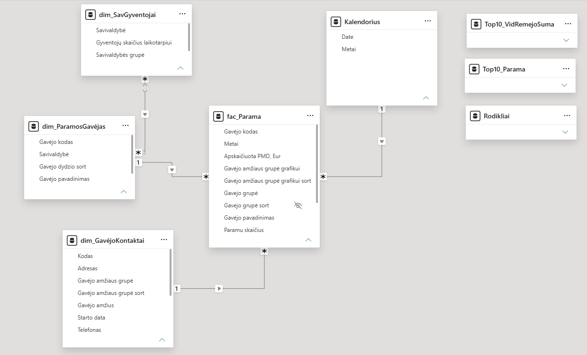

*Power BI data model showing the central fact table, supporting dimensions, relationships, and dedicated measure table.*

### 5. DAX Calculations

DAX was used to extend the transformed dataset with reusable analytical measures for **totals, distribution analysis, rankings, percentage shares, and changes over time**.

Most calculations are stored in a dedicated **`Rodikliai` measure table**, keeping analytical logic separate from the fact and dimension tables and making the model easier to maintain.

#### Core Measures and Descriptive Statistics

A small set of base measures provides the foundation for more complex calculations:

- **Total support amount** using `SUM()`
- **Number of supporters** using `SUM()`
- **Number of recipients** using `DISTINCTCOUNT()`
- **Average support per supporter** using `DIVIDE()`
- Descriptive statistics including **average, median, minimum, maximum, and mode**

More complex measures are built on these base measures rather than repeatedly recalculating the same logic. This **measure branching** approach improves readability, consistency, and maintainability.

#### Share-of-Total Calculations

Percentage measures compare individual recipients and recipient groups with the relevant total.

These include:

- Recipient share of total support
- Municipality share
- Support share by recipient age group
- Support share by municipality group
- Support share by manager gender
- Recipient-count share across the same categories

`CALCULATE()` together with `ALL()`, `ALLSELECTED()`, and `REMOVEFILTERS()` is used to deliberately control filter context.

For example, category filters can be removed from the denominator while retaining other active report filters. This allows measures to respond dynamically to report selections while still calculating the appropriate comparison total.

`DIVIDE()` is used instead of the `/` operator to safely handle zero or missing denominators.

#### Distribution and Concentration Analysis

Additional DAX measures investigate **how concentrated the 1.2% support distribution is among recipients**.

Recipients are dynamically evaluated according to the amount of support they receive, allowing different parts of the distribution to be compared with the overall amount of support.

More complex calculations use virtual tables and iterator functions such as `ADDCOLUMNS()`, `TOPN()`, `FILTER()`, `EXCEPT()`, and `SUMX()`.

`ALLSELECTED()` allows these calculations to respond to the active report context, meaning concentration can be analysed across both the complete dataset and selected subsets.

#### Ranking Calculations

Recipients are ranked dynamically according to:

- **Total support received**
- **Number of supporters**
- **Average support per supporter**

`RANKX()` with descending `DENSE` ranking is used so that the highest value receives rank 1.

Different filter-context approaches are used depending on the analytical purpose. `ALLSELECTED()` allows rankings to respond to the population currently selected in the report, while `ALL()` and `REMOVEFILTERS()` are used where a stable comparison against a wider population is required.

#### Year-to-Year Comparisons

DAX measures were created to analyse changes in both **support amount** and **number of supporters**.

The current value is compared with the previous available year using:

```text
(Current Value - Previous Value) / Previous Value
```

This produces a conventional percentage-change measure, where positive values represent growth and negative values represent decline.

Supporting measures identify the previous year with available data before calculating the percentage difference. `SELECTEDVALUE()` is used where a single year is required, while `MAXX()`, `FILTER()`, and `CALCULATE()` identify the relevant preceding period.

When no valid previous value exists, the measure deliberately returns `BLANK()` rather than displaying a misleading percentage.

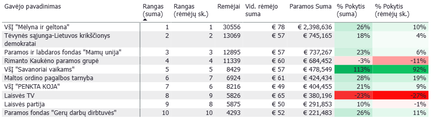

*Year-to-year DAX measures comparing support amounts and supporter counts with the previous available period, with conditional formatting highlighting growth and decline.*

#### Whole-Period Change

Separate measures compare the **first and last available values** for each recipient.

The first and last years containing positive support or supporter values are identified dynamically, after which the percentage change across the full available period is calculated.

This allows organisations that entered the dataset in different years to be compared according to their own available history rather than assuming that every recipient was present throughout the entire 2020–2024 period.

Additional checks using `ISBLANK()` and the number of selected years prevent percentage changes from being calculated where a meaningful comparison is not possible.

#### Dynamic Report Context

DAX is also used to make report elements respond to user selections.

For example, the selected-recipient measure uses `HASONEVALUE()`, `SELECTEDVALUE()`, `ISFILTERED()`, `VALUES()`, and `CONCATENATEX()` to dynamically display either a single selected recipient, multiple selected recipients, or a default label when no recipient filter is applied.

This improves report navigation and helps users understand the filter context behind the displayed results.

#### DAX Practices Applied

The DAX layer follows several practices intended to keep the model clear, reusable, and maintainable:

- **Dedicated measure table** to separate analytical calculations from source data
- **Measure branching** so complex calculations reuse established base measures
- **Variables (`VAR`)** to make multi-step calculations easier to read and debug
- **`DIVIDE()`** for safe percentage and ratio calculations
- **Explicit filter-context management** using `CALCULATE()`, `ALL()`, `ALLSELECTED()`, and `REMOVEFILTERS()`
- **Virtual tables** for dynamic ranking and distribution analysis
- **Iterator functions** such as `SUMX()`, `MAXX()`, and `MINX()` where row-by-row evaluation is required
- **`BLANK()` handling** to avoid presenting misleading results when valid comparisons are unavailable
- **Dynamic calculations** that respond to slicers and report selections rather than relying on static values

Together, these measures turn the cleaned dataset into an analytical model capable of exploring not only how much support was distributed, but also **how concentrated that support was, how recipients compare with one another, and how support patterns changed over time**.

### 6. Report Design and Interactivity

Power BI visualisations were selected and adapted to make the report clear, interactive, and easy to explore.

The report includes:

- Charts and KPI visuals
- Slicers
- Tooltips
- Drill-through pages
- Interactive filtering
- Yearly comparison views
- Conditional formatting

The report design aims to balance analytical detail with readability, allowing users to move from high-level trends to individual recipient-level information.

### 7. Reporting

The final report is published through **Power BI Service** and shared as a **Power BI App**.

This allows the completed report to be accessed independently from the Power BI Desktop development environment.

---

## Exploratory Analysis

The exploratory analysis provides an overview of **Lithuania's 1.2% support data from 2020 to 2024**. It was used to understand the scale and structure of the dataset, identify broad patterns, and determine which areas required deeper investigation.

### Overall Development

Approximately **€150M** was allocated through the 1.2% support system during the analysed period. Annual support increased from approximately **€22M in 2020 to €36M in 2024**.

The number of donors remained relatively stable at approximately **560K–604K**, while the number of eligible recipients changed more substantially. In 2024, the number of recipients fell to approximately **15K**, compared with around **22K in 2023**.

This decline coincides with **changes to the eligibility rules determining which organisations can receive 1.2% support**, rather than simply reflecting a decline in participation.

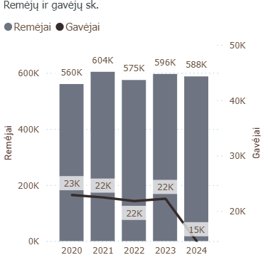

*Development of donor and eligible-recipient counts from 2020 to 2024. The sharp decline in recipients in 2024 coincides with changes to 1.2% support eligibility rules.*

### Recipient Characteristics

Recipient age was explored to determine whether the distribution of support differs between newer and more established organisations.

Organisations operating for **11–20 years represent 28% of recipients but receive 39% of total support**. Organisations aged **20+ years account for 43% of recipients and receive 36% of support**.

Younger organisations account for considerably smaller shares. Organisations operating for **0–2 years represent 2% of recipients and receive 1% of support**, while those operating for **3–5 years represent 8% of recipients and receive 7%**.

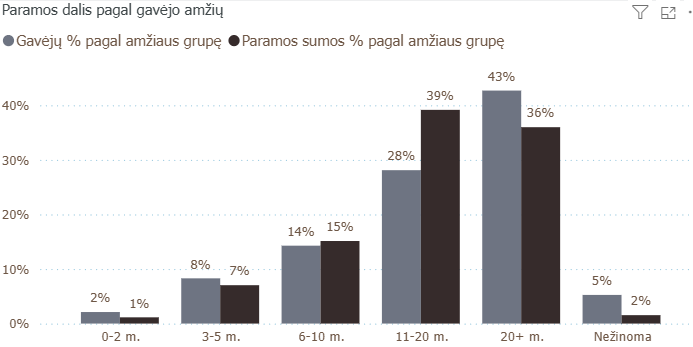

*Comparison of each organisation-age group's share of recipients with its share of total 1.2% support.*

### Geography and Legal Form

The exploratory analysis also revealed substantial differences by location and legal form.

Recipients registered in **Vilnius city municipality received approximately €74M**, considerably more than those registered in other municipalities.

By legal form, **public institutions** received the largest share of support, approximately **€51M (34%)**, followed by **associations with €38M (25%)** and **charity and support foundations with €19M (13%)**.

---

## Key Findings

The exploratory analysis was followed by a more focused investigation of the project's original research questions.

### 1. Who are the main recipients of 1.2% support?

A relatively small number of organisations account for a substantial amount of support.

Across 2020–2024, **VšĮ "Mėlyna ir geltona"** ranks first by total support, receiving approximately **€9.4M from 127.9K donors**. It is followed by **Rimanto Kaukėno paramos grupė (€3.5M)**, **Tėvynės sąjunga-Lietuvos krikščionys demokratai (€3.4M)**, and **Paramos ir labdaros fondas "Mamų unija" (€3.2M)**.

The Top 10 include organisations working across humanitarian aid, social support, children's welfare, media, and political activity, showing that the largest recipients do not belong to a single type of organisation.

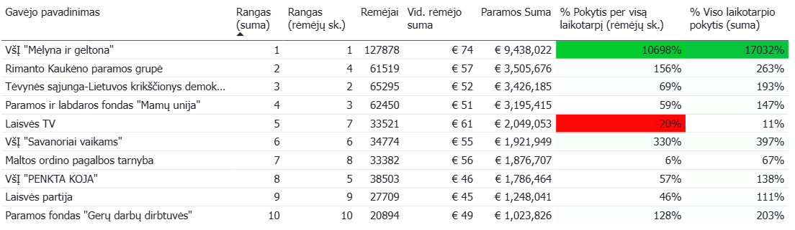

*Top 10 recipients across 2020–2024, comparing total support, number of donors, average support per donor, and change over time.*

### 2. How is support distributed among recipients?

Eligibility for 1.2% support does not guarantee a substantial inflow of funding. The amounts received vary considerably: while the largest single recipient received approximately **€3M in one year**, many eligible recipients received only small amounts, and some received no support at all.

Across 2020–2024:

- **Total support:** approximately €149.6M
- **Largest 20% of recipients:** approximately €94.4M
- **Smallest 80% of recipients:** approximately €25.7M
- **Top 10 recipients:** approximately €20M

The smallest 80% therefore received only about **17.2% of all support allocated during the analysed period**.

This demonstrates an important distinction between **being eligible for 1.2% support and being able to attract it**. Thousands of recipients participate in the system, but the financial benefit is distributed very unevenly.

### 3. How has the distribution changed between 2020 and 2024?

The overall amount of support increased from approximately **€22M in 2020 to €36M in 2024**, but this growth was not distributed equally.

Support received by the **largest 20% increased from approximately €15M to €24M**, while the amount received by the **Top 10 increased from around €2M to €6M**.

In contrast, the amount received by the **smallest 80% fell to approximately €3M in 2024**, despite total 1.2% support reaching its highest level during the analysed period.

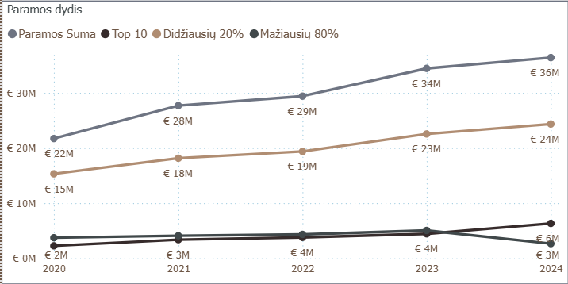

*Development of total support and the amounts received by the Top 10, largest 20%, and smallest 80% of recipients from 2020 to 2024.*

The relative shares make this shift even clearer.

The **smallest 80% received 17.2% of total support in 2020, but only 7.3% in 2024**. Over the same period, the share received by the **Top 10 increased from 10.4% to 17.4%**.

By 2024, the **Top 10 recipients alone therefore received more than twice the share allocated collectively to the smallest 80% of recipients**.

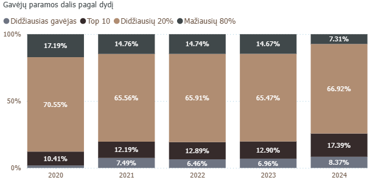

*Changing share of total support by recipient group, showing increasing concentration among the largest recipients between 2020 and 2024.*

The results indicate that although the total amount available through the system has grown, **support has become increasingly concentrated among larger recipients**.

### 4. Are the largest recipients becoming stronger over time?

At the aggregate level, the position of the largest recipients has strengthened. The increasing share captured by the Top 10, alongside the declining share received by the smallest 80%, points towards greater concentration at the top.

At the individual level, however, there is no single trajectory.

Several leading recipients experienced substantial growth in both donor numbers and support received. The most striking example is **VšĮ "Mėlyna ir geltona"**, whose donor count increased by more than **10,000%** and whose support amount increased by more than **17,000%** across the analysed period.

Other large recipients also show strong growth, while **Laisvės TV** provides an important exception: it remained among the largest recipients despite experiencing a decline in donor numbers.

The recipient-level analysis therefore suggests that many of the largest recipients show a **more consistent growth pattern**, but being a large recipient does not automatically guarantee continued growth.

### 5. Who may be left behind in the competition for support?

The national-level distribution shows that being eligible for support does not necessarily translate into meaningful funding. To investigate this further, individual recipients were compared using **total support, number of donors, average support per donor, ranking, and change over time**.

The analysis shows that some groups of organisations operate on a dramatically smaller scale than the national leaders.

This is visible among organisations supporting people with **visual impairments**. Many receive only a few hundred or a few thousand euros and rely on relatively small donor bases. Several also experienced declining donor numbers during the analysed period.

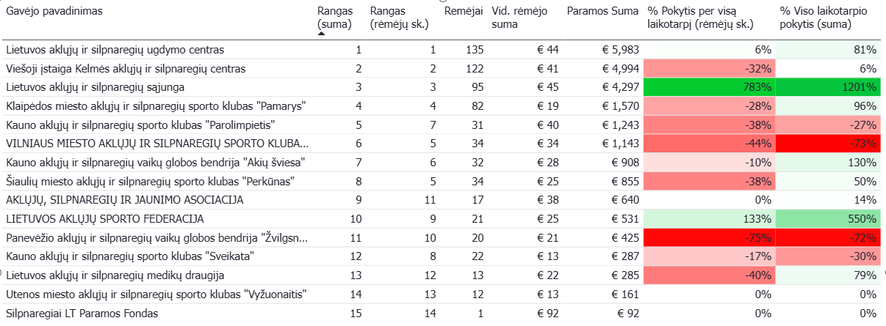

*Recipient-level comparison of organisations supporting people with visual impairments, highlighting differences in donor bases, support amounts, rankings, and changes over time.*

A similar pattern appears among organisations supporting people with **hearing impairments**. Some experienced substantial percentage growth, but many continue to operate with relatively small donor bases and modest total support. Several organisations also experienced substantial declines.

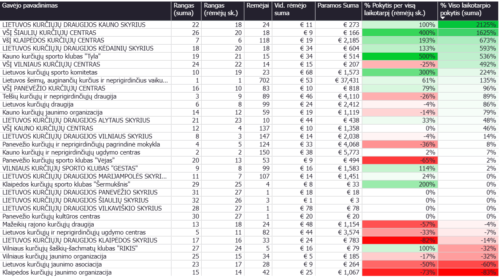

*Recipient-level comparison of organisations supporting people with hearing impairments, showing substantial differences in scale and development between recipients.*

However, **small size alone should not be interpreted as poor performance**.

Some recipients have very few donors but receive comparatively high average contributions per donor. This highlights an important characteristic of the 1.2% support system: **the number of supporters alone does not determine the amount of support an organisation can attract**. Because the allocation is based on personal income tax paid, the value of individual contributions is directly connected to supporters' taxable income.

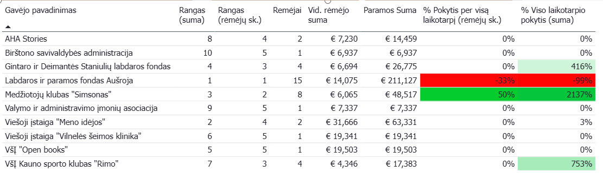

*Recipients with comparatively high average support per donor, illustrating how a small donor base can still generate substantial support when individual allocations are larger.*

This may suggest that the amount of support an organisation can attract depends not only on the **size of the community behind an initiative, but also on its financial capacity**. Organisations supported by higher-income groups may be able to generate substantial funding from relatively few supporters, while organisations representing lower-income communities may require considerably more supporters to achieve the same level of funding.

For this reason, the organisations most likely to be "left behind" cannot be identified simply by selecting the smallest recipients. Their position may reflect a combination of a **small donor base, low total support, declining support or donor numbers over time, and the financial capacity of the community they represent or reach**.

While the data reveals substantial differences in average support per donor, confirming the relationship with supporter income would require individual-level income data.

---

## Overall Finding

The analysis shows that Lithuania's 1.2% support system **grew substantially in monetary value between 2020 and 2024, while the distribution of support became increasingly concentrated**.

A large number of eligible recipients does not mean that funding is widely distributed. While the largest recipient received approximately **€3M in a single year**, many recipients received only minimal amounts or no support at all.

The difference became particularly pronounced in 2024: the **smallest 80% of recipients collectively received only 7.3% of total support**, while the **Top 10 alone received 17.4%**.

At the same time, recipient-level analysis shows that the picture is more complex than a simple division between "large" and "small". Some leading organisations have grown dramatically, others have lost donors, and some small organisations attract relatively high contributions from only a handful of supporters.

The strongest position appears to belong to organisations that can **attract and retain substantial donor bases over time**. However, because 1.2% support is linked to personal income tax paid, the analysis also suggests that the **financial capacity of the community behind an initiative may influence how much support it can generate**. Organisations with smaller, lower-income supporter bases may therefore face an additional disadvantage even when they succeed in mobilising their communities.

Recipients combining **few donors, low support amounts, and declining support or donor numbers** appear to occupy the weakest position.

---

## Author

Created by **Ramune Idzelyte**

Have a project where data, people, or impact matter? I would be happy to connect on [LinkedIn](https://www.linkedin.com/in/idzelyte).
